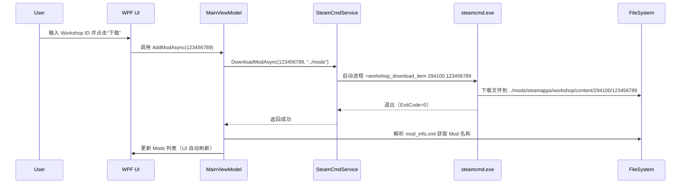

# 基于 SteamCMD 的 Mod 管理器项目结构与开发指南

> 适用于 .NET 6+ WPF 桌面应用，支持 RimWorld、ARK 等 Steam 创意工坊（Workshop）游戏的 Mod 下载与管理。

---

## 📁 一、整体项目结构

```
RimWorldModManager/                     ← 解决方案根目录
├── RimWorldModManager.sln              ← Visual Studio 解决方案文件
│
├── src/
│   └── RimWorldModManager/             ← 主 WPF 项目（.NET 6+）
│       ├── App.xaml / App.xaml.cs
│       ├── MainWindow.xaml / MainWindow.xaml.cs
│       ├── Models/                     ← 数据模型
│       ├── Views/                      ← XAML 视图（可选分层）
│       ├── ViewModels/                 ← MVVM ViewModel（推荐）
│       ├── Services/                   ← 核心服务（SteamCMD、文件操作等）
│       ├── Utils/                      ← 工具类（路径、日志等）
│       ├── Controls/                   ← 自定义控件（如 ModCard.xaml）
│       ├── Resources/                  ← 资源字典（主题、图标）
│       └── RimWorldModManager.csproj
│
├── steamcmd/                           ← SteamCMD 客户端（解压即用）
│   ├── steamcmd.exe
│   ├── steam.dll
│   └── ...（其他文件）
│
├── mods/                               ← 默认 Mod 下载目录（可配置）
│   └── (空，运行时生成)
│
├── config/                             ← 用户配置（JSON/YAML）
│   └── settings.json                   ← 存储 Steam 路径、Mod 目录等
│
└── docs/                               ← 文档（可选）
    └── README.md
```

### ✅ 设计原则
- `steamcmd/` 与 `mods/` 放在**解决方案根目录**（非项目内），避免被编译进输出目录；
- 所有路径通过 `AppDomain.CurrentDomain.BaseDirectory` 动态计算，确保调试/发布路径一致；
- 配置与数据分离，支持用户自定义。

---

## 🔧 二、核心模块详解

### 1. **Services/ —— SteamCMD 封装**
```csharp
// Services/SteamCmdService.cs
public class SteamCmdService
{
    private readonly string _steamCmdPath;
    private readonly ILogger _logger;

    public SteamCmdService(string steamCmdPath, ILogger logger)
    {
        _steamCmdPath = steamCmdPath; // 指向 ../steamcmd/steamcmd.exe
        _logger = logger;
    }

    public async Task<ProcessResult> DownloadModAsync(int workshopId, string installDir)
    {
        var args = new[]
        {
            "+login", "anonymous",
            "+force_install_dir", installDir,
            "+workshop_download_item", "294100", workshopId.ToString(), // RimWorld AppID=294100
            "+quit"
        };
        return await ExecuteAsync(args);
    }

    private async Task<ProcessResult> ExecuteAsync(string[] args) { /* 封装 Process.Start */ }
}
```

### 2. **Models/ —— Mod 元数据**
```csharp
// Models/ModInfo.cs
public class ModInfo
{
    public int WorkshopId { get; set; }
    public string Name { get; set; }
    public string Description { get; set; }
    public string LocalPath { get; set; } // 如: mods/294100/workshop/123456789
    public DateTime LastUpdated { get; set; }
    public bool IsEnabled { get; set; }   // 是否启用（用于游戏加载）
}
```

### 3. **ViewModels/ —— MVVM 绑定逻辑**
```csharp
// ViewModels/MainViewModel.cs
public class MainViewModel : INotifyPropertyChanged
{
    private readonly SteamCmdService _steamService;
    public ObservableCollection<ModInfo> Mods { get; } = new();

    public async Task AddModAsync(int workshopId)
    {
        var installDir = Path.Combine(AppContext.BaseDirectory, "..", "mods");
        await _steamService.DownloadModAsync(workshopId, installDir);
        
        // 解析下载后的 mod_info.xml 获取名称/描述
        var mod = ParseModInfo(workshopId, installDir);
        Mods.Add(mod);
    }
}
```

### 4. **Utils/ —— 路径与配置工具**
```csharp
// Utils/PathHelper.cs
public static class PathHelper
{
    public static string GetSolutionRoot() => 
        Path.GetFullPath(Path.Combine(AppContext.BaseDirectory, ".."));

    public static string GetSteamCmdExePath() => 
        Path.Combine(GetSolutionRoot(), "steamcmd", "steamcmd.exe");

    public static string GetDefaultModsPath() => 
        Path.Combine(GetSolutionRoot(), "mods");
}
```

### 5. **config/settings.json —— 用户配置**
```json
{
  "GamePaths": {
    "RimWorld": "C:\\Program Files (x86)\\Steam\\steamapps\\common\\RimWorld"
  },
  "ModDirectories": [
    "C:\\Users\\YourName\\AppData\\LocalLow\\Ludeon Studios\\RimWorld by Ludeon Studios\\Mods",
    "../mods"  // 相对路径指向解决方案根目录下的 mods/
  ],
  "SteamCmdPath": "../steamcmd/steamcmd.exe"
}
```

---

## ⚙️ 三、关键交互流程



---

## 🔒 四、安全与健壮性设计

| 风险 | 解决方案 |
|------|----------|
| **SteamCMD 路径错误** | 启动时校验 `File.Exists(PathHelper.GetSteamCmdExePath())` |
| **重复下载同一 Mod** | 检查 `mods/.../workshop_id` 目录是否存在 |
| **网络超时** | 在 `ProcessStartInfo` 中设置 `Timeout`（需自定义封装） |
| **权限不足写入 mods/** | 提示用户选择有写入权限的目录（如文档文件夹） |
| **SteamCMD 卡死** | 监控进程 CPU/内存，超时强制 Kill |

---

## 📦 五、部署建议

### 1. **打包时包含 steamcmd/**
在 `.csproj` 中添加：
```xml
<ItemGroup>
  <None Include="..\steamcmd\**" Link="steamcmd\%(RecursiveDir)%(Filename)%(Extension)" CopyToOutputDirectory="PreserveNewest" />
</ItemGroup>
```

> **更推荐方案**：首次启动时自动从 [官方链接](https://developer.valvesoftware.com/wiki/SteamCMD#Downloading_SteamCMD) 下载 `steamcmd.zip` 并解压，避免分发体积过大。

### 2. **单文件发布注意事项**
- `steamcmd.exe` 不能嵌入单文件（需外部存放）；
- 修改 `PathHelper` 逻辑：若检测到单文件模式，则从 `%LOCALAPPDATA%\YourApp\steamcmd` 加载。

---

## ✅ 六、验证步骤

1. 创建上述目录结构；
2. 从 [SteamCMD 官网](https://developer.valvesoftware.com/wiki/SteamCMD#Downloading_SteamCMD) 下载并解压到 `steamcmd/`；
3. 运行 WPF 应用 → 输入 Workshop ID（如 [Vanilla Expanded](https://steamcommunity.com/sharedfiles/filedetails/?id=2011337079) 的 ID `2011337079`）；
4. 观察 `mods/` 目录是否生成对应文件夹；
5. 检查 UI 是否显示 Mod 名称和状态。

---

> 💡 **提示**：本结构已考虑工程化扩展性，后续可轻松集成：
> - Mod 启用/禁用（修改游戏配置文件）
> - 版本更新检查（对比 Workshop 最新时间戳）
> - 多游戏支持（通过配置切换 AppID）